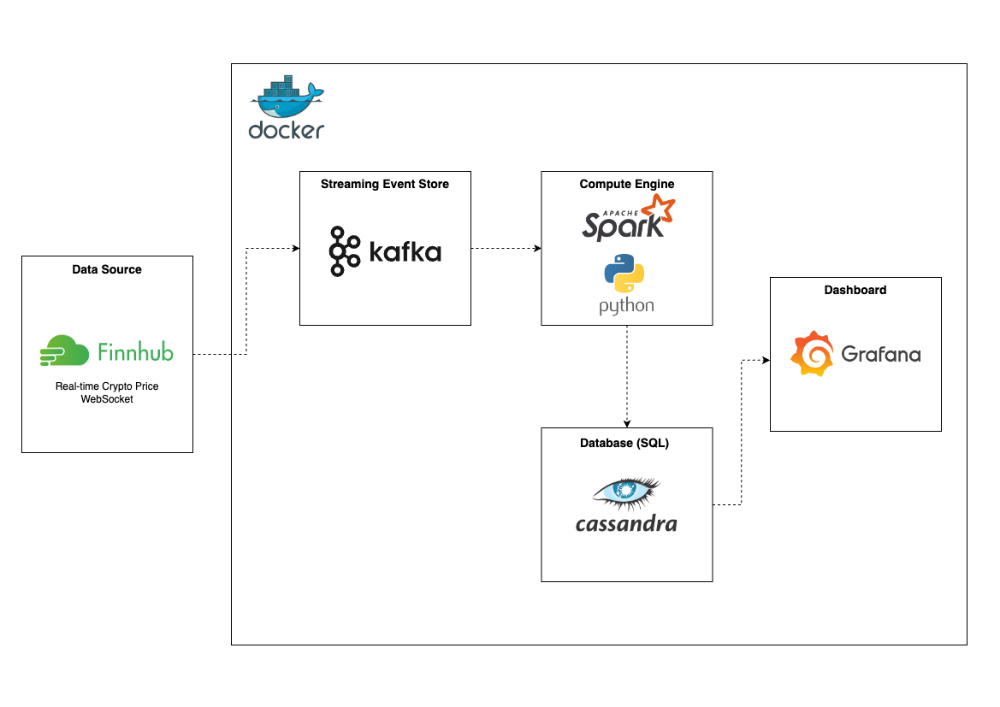

# Cryptocurrency Real-Time Data Stream

A real-time cryptocurrency streaming pipeline that pulls ticker information from a Finnhub websocket. The data is pushed to a Kafka topic where it is processed by a Spark worker (using PySpark) and written to a Cassandra table. A Grafana dashboard reads from Cassandra and publishes the currency price and volume over time, refreshing every second. 

All infrastructure is hosted in Docker. The Producer and Spark Processor run in a Poetry controlled virtual env. 

## Requirements:
- Finnhub API key
- Docker
- Poetry 
- 8GB RAM

## To build & run:
### 1. Build the infrastructure:
```
make infra
```

### 2. Stream data to Kafka:
Note: Only produce data when all docker services are up and running
```
make produce 
```

### 3. Process the data using Spark and write to DB:
Note: Do this in a seperate terminal from the stream
```
make process 
```

### 4. Visualize the data:
Open **http://localhost:9000/dashboards** and click on **'Real Time BTC/USDT Statistics'** to launch the **Grafana** dashboard (which was launched by the docker-compose).
The dashboard will refresh every second and update automatically. 

### 5. To exit:
Exit both terminals (ctrl + c in each) and run ```make down``` to tear down the Docker infrastructure. 

## Data Flow Diagram

